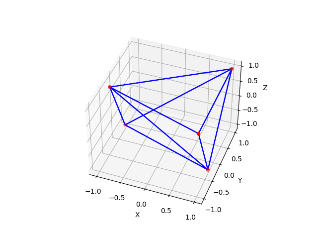
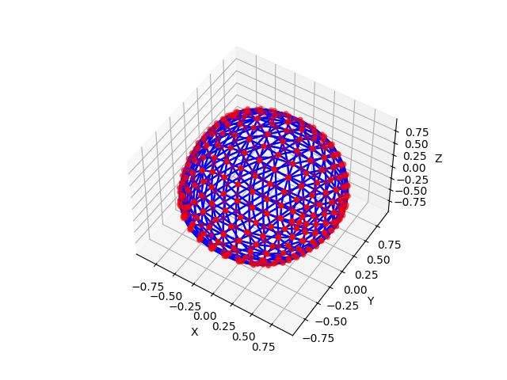
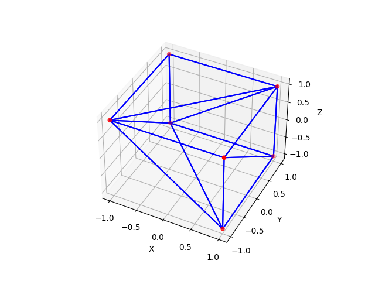
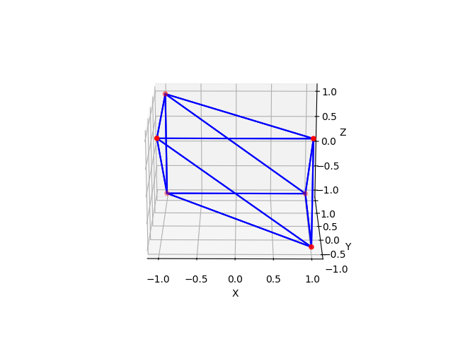
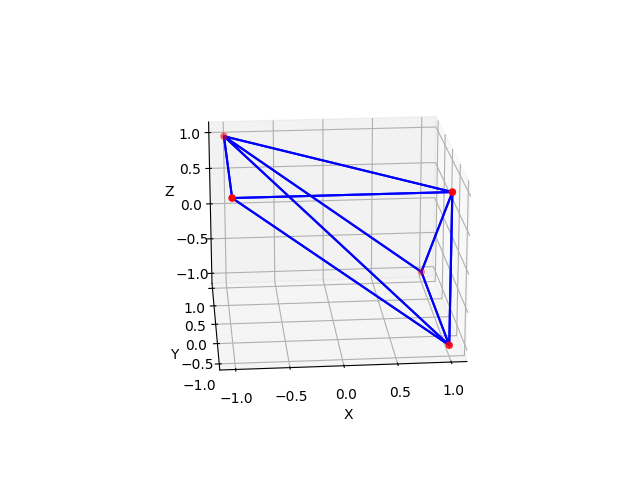
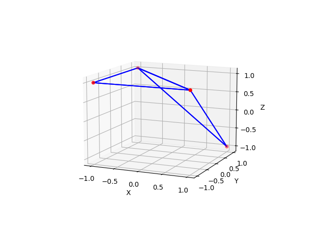

# CSCI599

## How to use starter code
```shell
git clone https://github.com/jingyangcarl/CSCI599.git
cd CSCI599
ls ./ # you should see index.html and README.md showup in the terminal
code ./ # open this folder via vscode locally
# open and right click on the index.html
# select "Open With Live Server" to run the code over localhost.
```

## Project Details
This project explores advanced techniques for editing 3D models, focusing on two main methods: Loop Subdivision and Quadric Error Mesh Simplification, using a special way of organizing 3D model data called the half-edge data structure for better performance.

Loop Subdivision
Loop Subdivision is a technique that makes rough or blocky 3D models look smoother and more detailed. It works well with models made up of triangles. The idea is to take a simple model and make it more complex by adding more triangles in a smart way, based on the positions of the original points (vertices). The half-edge data structure is used here because it helps keep track of how points, lines (edges), and surfaces (faces) are connected, making it easier to figure out where to add new points and triangles.

When we start, we first organize the model's data using the half-edge structure. Then, we calculate where new points should go using a special formula. If we're working on the edge of the model, we simply put a new point in the middle. But if it's an interior part, we use the formula to decide the exact spot based on nearby points and edges. After placing new points, we connect them to form new, smaller triangles. Doing this several times makes the model smoother and more detailed with each step.

Quadric Error Mesh Simplification
This method aims to make a 3D model simpler by reducing the number of triangles it has, without losing its essential shape. It does this by measuring how much error would be introduced if we remove certain points and reorganize the remaining ones. Each point gets a score that tells us how much the model's shape would change if that point were removed. The process involves picking points with the lowest scores (meaning their removal would change the model the least) and removing them, then updating the model.

The half-edge data structure is crucial here too because it lets us quickly find which points and faces are connected, making it easier to calculate scores and decide which points to remove. For each point considered for removal, the method looks for the best new position that would introduce the least error, then updates the model by removing the point and adjusting the connections. This process is repeated until the model is as simple as needed.

In simpler terms, these techniques help in making 3D models look better or simpler, depending on what's needed, by adding or removing points and triangles in a smart way, with the help of a special way of organizing the model's data.

Time Complexity:
My analysis, based on the details of my implementation, suggests:

Loop Subdivision: Exponential in the number of iterations, roughly O(4^i * (V + E + F)), due to the quadrupling of faces with each iteration and the rebuilding of the half-edge structure.
Quadric Error Metrics Decimation: Dominated by edge collapse priority queue operations, O(E * log E), with significant overhead from mesh updates and error quadric computations.
These complexities reflect the nature of the operations I performed in my implementations, though actual performance can vary with the structure of the mesh and the specifics of my implementation.

## Decimation Plots





## Subdivision Plots




## Extra Credits









